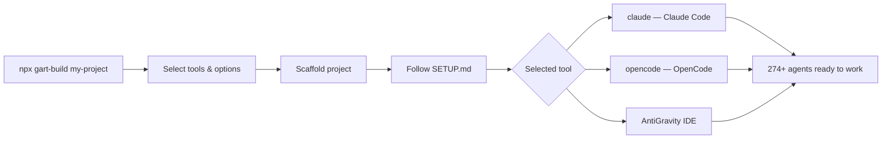
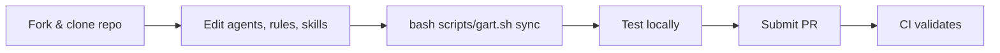
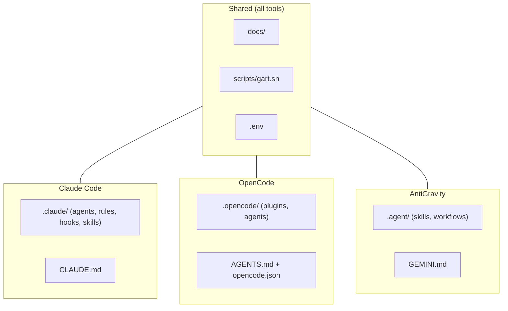

# GART — Generative Agent Runtime Toolkit

> Scaffold multi-IDE agentic coding projects with **144+ AI agents** in one command.

```bash
npx gart-build my-project
```

GART sets up a complete AI agent orchestration environment for **Claude Code**, **OpenCode** (Google Gemini), and **AntiGravity IDE** — with pre-configured agents, skills, hooks, scoped rules, and MCP server integrations.

## Quick Start

```bash
npx gart-build my-project
cd my-project
cp .env.example .env     # Add your API keys
claude                   # or: opencode / open in AntiGravity
```

The interactive CLI lets you:

- **Choose your tools** — select which AI IDEs to configure (space to toggle)
- **Set agent language** — agents respond in your preferred language
- **Auto-scaffold** — only the configs you need, clean and ready

## What You Get

| Component                 | Details                                                                                    |
| ------------------------- | ------------------------------------------------------------------------------------------ |
| **274 Specialist Agents** | Engineering, Design, Game Dev, Marketing, Sales, QA, and more                              |
| **Agent Orchestration**   | Team coordinators, division routing, central orchestrator                                  |
| **19 Skills**             | Frontend design, debugging, brainstorming, git workflow, LSP navigation                    |
| **23 Scoped Rules**       | TypeScript, React, security, performance, accessibility, API design, and more              |
| **11 Hooks**              | Dangerous command blocker, env leak protection, secret detection, auto-format, audit trail |
| **MCP Pre-config**        | GitHub, Memory, Playwright servers ready out of the box (`.mcp.json`)                      |
| **Documentation**         | Guides, ADR templates, task tracking, agent workflow reference                             |

## How GART Works

### End User Workflow



_For end users — install, configure, work. No repo cloning needed._

### Contributor Workflow



_For contributors — fork, modify, sync, test, PR. Full access to docs-dev/, cli/, .github/._

### Tool Switching Architecture



_Switch freely — shared docs and scripts, tool-specific configs isolated._

## Supported Tools

| Tool            | Config Files                               | What's Included                           |
| --------------- | ------------------------------------------ | ----------------------------------------- |
| **Claude Code** | `.claude/`, `CLAUDE.md`, `.mcp.json`       | 274 agents, 19 skills, 11 hooks, 25 rules |
| **OpenCode**    | `.opencode/`, `opencode.json`, `AGENTS.md` | 154 agents, 25 skills, commands           |
| **AntiGravity** | `.agent/`, `GEMINI.md`                     | 155 skills, 25 rules, 6 workflows         |

## Scoped Rules (Claude Code)

GART includes 23 per-domain rule files in `.claude/rules/` — loaded automatically when Claude works with matching files:

| Category       | Rules                                                                                                               |
| -------------- | ------------------------------------------------------------------------------------------------------------------- |
| **Base**       | core, code-generation, navigation, security, boundaries, mcp-tools, git, performance, error-handling, documentation |
| **Languages**  | typescript, python, css, html                                                                                       |
| **Frameworks** | react, nextjs, tailwind                                                                                             |
| **Testing**    | testing, e2e                                                                                                        |
| **API & DB**   | api-design, database                                                                                                |
| **DevOps**     | docker, ci-cd                                                                                                       |
| **Quality**    | accessibility, code-review                                                                                          |

## Hooks (Claude Code)

11 hooks in `.claude/hooks/` — automated safety, quality, and audit:

| Hook                       | Type     | What it does                                      |
| -------------------------- | -------- | ------------------------------------------------- |
| `block-dangerous-commands` | Security | Blocks `rm -rf`, `git push --force`, `DROP TABLE` |
| `prevent-env-leak`         | Security | Blocks `cat .env`, `printenv`, secret exposure    |
| `protect-files`            | Security | Blocks editing `.env`, credentials, `.git/`       |
| `detect-secrets`           | Security | Blocks hardcoded API keys, tokens, passwords      |
| `validate-commit-msg`      | Quality  | Enforces Conventional Commits format              |
| `auto-format`              | Quality  | Runs Prettier after edits                         |
| `typecheck`                | Quality  | Runs `tsc --noEmit` after TS edits                |
| `audit-trail`              | Audit    | Logs every action to JSONL                        |
| `bash-logger`              | Audit    | Logs bash commands with timestamps                |
| `dep-audit`                | Workflow | Runs `npm audit` after package.json changes       |
| `warn-large-files`         | Workflow | Warns when files exceed 500 lines                 |

## Scoped Rules & Workflows (AntiGravity)

GART includes the same 23 per-domain rule files in `.agent/rules/` — loaded automatically when AntiGravity works with matching files. Same categories as Claude Code rules above.

6 workflows in `.agent/workflows/` — triggered via `/` command:

| Workflow         | What it does                                                            |
| ---------------- | ----------------------------------------------------------------------- |
| `orchestrate`    | Multi-agent delegation across specialist domains                        |
| `code-review`    | Structured review: OK / Needs improvement / Critical                    |
| `debugging`      | 6-step protocol: reproduce, isolate, inspect, hypothesize, fix, prevent |
| `git-workflow`   | Branch naming, Conventional Commits, PR checklist                       |
| `testing`        | Test strategy: unit, integration, e2e with coverage targets             |
| `security-audit` | OWASP Top 10 checklist, dependency audit, secrets check                 |

## Prerequisites

- [Node.js](https://nodejs.org/) >= 18.0.0
- [Bun](https://bun.sh/) >= 1.0.0 (for OpenCode plugin)
- [Docker Desktop](https://www.docker.com/products/docker-desktop/) (for MCP Docker Gateway)

## Agent Divisions

Agents are organized into specialized divisions:

| Division     | Examples                                                             |
| ------------ | -------------------------------------------------------------------- |
| Engineering  | Backend Architect, Frontend Developer, DevOps, AI Engineer, Security |
| Design       | UX Architect, UI Designer, Brand Guardian, Visual Storyteller        |
| Game Dev     | Unity, Unreal, Godot specialists, Level Designer, Narrative Designer |
| Marketing    | Content Creator, SEO, Social Media, Growth Hacker                    |
| QA & Testing | API Tester, Performance Benchmarker, Evidence Collector              |
| Specialized  | MCP Builder, Blockchain Auditor, Data Engineer, Technical Writer     |

Update agents to the latest version:

```bash
bash scripts/gart.sh sync
```

## How It Works

1. `npx gart-build` downloads the latest template from this repository
2. You select which AI coding tools you use (Claude Code, OpenCode, AntiGravity)
3. You choose your preferred agent response language
4. GART scaffolds only the selected configs into your project
5. Generated `package.json`, `README.md`, and `.mcp.json` are tailored to your selection

## Contributing

This repository is the source for both the GART CLI and the template it scaffolds.

```bash
git clone https://github.com/iFrescoo/gart.git
cd gart

# CLI development
cd cli
npm install
npm run build
npm link              # Now 'gart-build' command is available globally

# Test scaffolding
gart-build test-project
```

### Repository Structure

```
├── cli/              # GART CLI source (published to npm as "gart-build")
├── .claude/          # Claude Code agents, skills, hooks, rules
│   ├── agents/       # 274 specialist agents
│   ├── skills/       # 19 skills + orchestration
│   ├── hooks/        # 11 safety & quality hooks
│   └── rules/        # 23 scoped rules (per-domain)
├── .opencode/        # OpenCode agents, skills, commands
├── .agent/           # AntiGravity skills, workflows
├── scripts/          # Agent sync pipeline
├── docs/             # Documentation templates
├── CLAUDE.md         # Claude Code instruction file
├── AGENTS.md         # OpenCode instruction file
├── GEMINI.md         # AntiGravity instruction file
├── ROADMAP.md        # Future plans
└── marketplace.json  # Plugin marketplace metadata
```

### Publishing

```bash
cd cli
npm run build
npm publish           # Requires npm login
```

Or push a version tag for automatic publishing:

```bash
git tag v1.1.0
git push origin v1.1.0   # GitHub Action publishes to npm
```

## Acknowledgements

GART builds on top of the excellent work from:

- **[msitarzewski/agency-agents](https://github.com/msitarzewski/agency-agents)** — The upstream source for 274+ specialist AI agents, organized by division and role. GART's sync pipeline (`gart.sh sync`) pulls, enriches, and deploys these agents across Claude Code, OpenCode, and AntiGravity IDE.
- **[Anthropic](https://anthropic.com)** — Claude Code and the Claude API powering the agent runtime.
- **[OpenCode](https://opencode.ai)** — Multi-model AI coding assistant with plugin architecture.
- **[mksglu/context-mode](https://github.com/mksglu/context-mode)** — Privacy-first MCP server for context window protection. Keeps raw tool output in a sandbox, reducing context consumption by ~98%.
- **[vudovn/antigravity-kit](https://github.com/vudovn/antigravity-kit)** — Community agent/skill/workflow kit for Google AntiGravity IDE. Inspired GART's `.agent/` structure with specialized agents, skills, and workflows.
- **[mixedbread-ai/mgrep](https://github.com/mixedbread-ai/mgrep)** — Semantic code search CLI by Mixedbread AI. Used in GART's OpenCode setup for intent-based code exploration alongside traditional grep.
- **[skillsmp.com](https://skillsmp.com)** — Community skill marketplace with 280K+ indexed Agent Skills. Browse and discover skills for Claude Code, OpenCode, and more.
- **[skills.sh](https://skills.sh)** — Vercel-backed skill leaderboard with install telemetry tracking across 19+ AI coding agents.

## License

[MIT](LICENSE)
